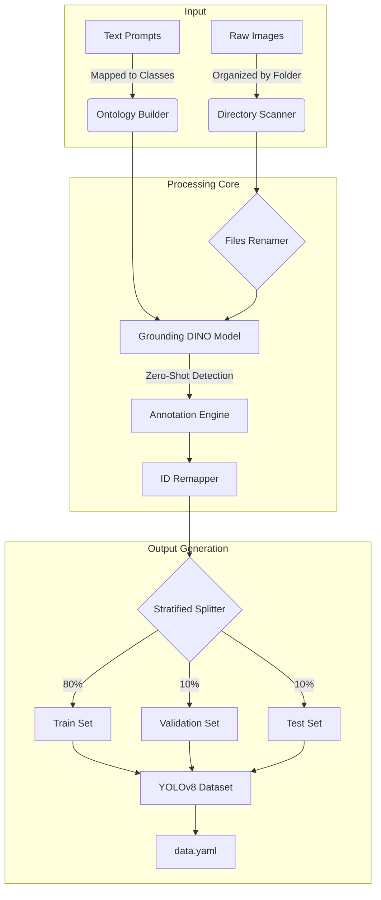

# 🏷️ Auto-Annotation Tool for Object Detection

[](https://www.python.org/)
[](https://pytorch.org/)
[](https://github.com/ultralytics/ultralytics)
[](LICENSE)

> **Automated, zero-shot image annotation pipeline using Grounding DINO to generate instant YOLOv8 object detection datasets.**

## 📋 Table of Contents
- [Overview](#overview)
- [Key Features](#key-features)
- [System Architecture](#system-architecture)
- [Installation](#installation)
- [Usage Workflow](#usage-workflow)
- [Project Structure](#project-structure)
- [Configuration](#configuration)
- [Troubleshooting](#troubleshooting)
- [Contributing](#contributing)
- [Acknowledgments](#acknowledgments)

---

## 🎯 Overview

The **Auto-Annotation Tool** eliminates the bottleneck of manual data labeling in computer vision projects. By leveraging **Grounding DINO**, a state-of-the-art open-set object detector, this tool allows you to generate high-quality, training-ready datasets simply by organizing images into folders and providing text descriptions.

### The Problem
Building custom object detection models typically requires:
- Hours of tedious manual bounding box drawing.
- Expensive labeling services.
- Inconsistent label quality across different annotators.

### Our Solution
A fully automated pipeline that:
1.  **Ingests raw images** organized by class.
2.  **Applys Zero-Shot Detection** using text prompts (e.g., "coffee mug", "printer").
3.  **Auto-Labels** every image with high-precision bounding boxes.
4.  **Exports** a perfectly formatted, stratified YOLOv8 dataset ready for training.

---

## ✨ Key Features

- 🧠 **Zero-Shot Learning** - No initial training required; finds objects based on natural language descriptions.
- 🔄 **Automated Workflow** - From raw images to split dataset (Train/Val/Test) in one command.
- ⚙️ **Multi-Class Support** - Handles complex datasets with multiple object categories simultaneously.
- 🎯 **Smart Remapping** - Automatically manages internal class IDs to ensure YOLO format compliance.
- 📊 **Stratified Splits** - Maintains class balance with a default 80/10/10 split.
- 👁️ **Built-in Visualization** - Includes a dedicated tool to visually verify annotations before training.
- 🔧 **Hardware Flexible** - Runs on CUDA-enabled GPUs or falls back to CPU for universal compatibility.

---

## 🏗️ System Architecture

The pipeline automates the interaction between raw data, the Grounding DINO model, and the final dataset structure.



---

## 🚀 Installation

### Prerequisites
- **Python:** 3.10, 3.11, or 3.12 (Python 3.14 is currently **unsupported**).
- **OS:** Windows, Linux, or macOS.
- **Hardware:** NVIDIA GPU (RTX 30XX or older recommended) or CPU.

### Setup Steps

1.  **Clone the Repository**
    ```bash
    git clone <your-repo-url>
    cd Auto-Annotation
    ```

2.  **Create a Virtual Environment**
    ```bash
    # Windows
    python -m venv venv
    .\venv\Scripts\activate

    # Linux/macOS
    python3 -m venv venv
    source venv/bin/activate
    ```

3.  **Install Dependencies**
    ```bash
    pip install -r requirements.txt
    ```

4.  **Apply Hotfix (If using Python 3.12)**
    *See the [Troubleshooting](#troubleshooting) section if you encounter OpenCV errors.*

---

## 🎯 Usage Workflow

### 1. Organize Images
Create an `images/` directory and place your raw images into subfolders named after their class.

```text
images/
├── Mouse/       # Contains mouse images
├── Keyboard/    # Contains keyboard images
└── Mug/         # Contains mug images
```

### 2. Configure Prompts
Open `Auto_Annotate.py` and map your folder names to descriptive text prompts for the model.

```python
# Auto_Annotate.py

prompt_mapping = {
    "Mouse": "computer mouse",    # Folder Name : Description
    "Keyboard": "mechanical keyboard",
    "Mug": "coffee mug",
}
```

### 3. Run Pipeline
Execute the main script to generate your dataset.

```bash
python Auto_Annotate.py
```

### 4. Verify Results
Run the visualization tool to draw bounding boxes on the generated dataset for inspection.

```bash
python visualize_yolo.py
```
*Results will be saved to the `visualizations/` folder.*

---

## 📁 Project Structure

```bash
Auto-Annotation/
├── Auto_Annotate.py          # 🧠 Main pipeline script
├── visualize_yolo.py         # 👁️ Visualization utility
├── requirements.txt          # 📦 Dependencies
├── fixes/                    # 🩹 Hotfixes for dependencies
├── images/                   # 📥 Input: User images organized by class
│   ├── Mouse/
│   └── Keyboard/
└── YOLO_DATA/                # 📤 Output: Final Dataset
    ├── train/
    ├── val/
    ├── test/
    └── data.yaml             # YOLO configuration file
```

---

## 🔧 Configuration

All customizable settings are located at the top of `Auto_Annotate.py`:

| Variable | Description | Default |
| :--- | :--- | :--- |
| `input_folder` | Path to raw images | `./images` |
| `output_folder` | Path for generated dataset | `YOLO_DATA` |
| `train_split` | Percentage of images for training | `0.8` |
| `val_split` | Percentage of images for validation | `0.1` |
| `prompt_mapping` | Dictionary mapping folders to prompts | `{}` |

---

## 🐛 Troubleshooting

### 🛑 OpenCV/Python 3.12 Error
If you see `TypeError: Can't convert object to 'str' for 'filename'`, you need to patch `autodistill-grounding-dino`.

**The Fix:**
Run the following command to overwrite the faulty library file with the keyed version provided in `fixes/`:

```powershell
# Windows Example
cp fixes/grounding_dino_model.py venv/Lib/site-packages/autodistill_grounding_dino/grounding_dino_model.py
```

### 🛑 CUDA / GPU Issues
If you encounter errors with RTX 40XX/50XX cards or driver conflicts, force CPU mode by ensuring this line is active at the top of `Auto_Annotate.py`:

```python
import os
os.environ['CUDA_VISIBLE_DEVICES'] = '-1'  # 1 = Force CPU, Comment out to use GPU
```

---

## 🤝 Contributing

Contributions are welcome! Please feel free to submit a Pull Request.

1. Fork the project
2. Create your feature branch (`git checkout -b feature/AmazingFeature`)
3. Commit your changes (`git commit -m 'Add some AmazingFeature'`)
4. Push to the branch (`git push origin feature/AmazingFeature`)
5. Open a Pull Request

---

## 🙏 Acknowledgments

- **[Autodistill](https://github.com/autodistill/autodistill)** - The backbone of our auto-labeling pipeline.
- **[Grounding DINO](https://github.com/IDEA-Research/GroundingDINO)** - The incredible zero-shot object detector.
- **[YOLOv8](https://github.com/ultralytics/ultralytics)** - For establishing the dataset standard.

---

<div align="center">

**⭐ If you find this tool useful, please give it a star! ⭐**

</div>
